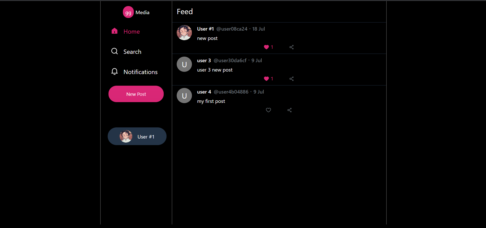
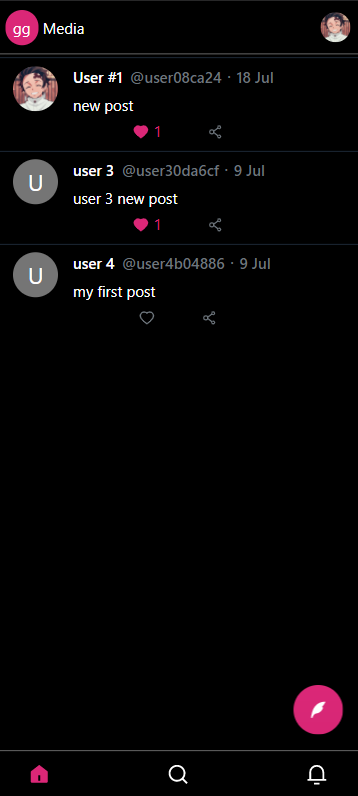
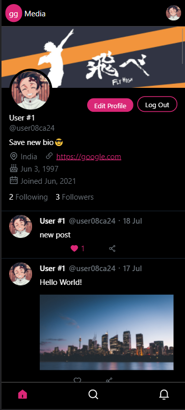

# GG Media

A social media platform built with React, Redux. UI/UX design styles inspired from twitter.

Live link: https://ggmedia.netlify.app

Backend: https://github.com/OmkarArora/gg-backend

---

## Tech stack

- Frontend
  - React
  - Redux
  - React Router
  - [Shoto UI](https://shotoui.netlify.app)
- Backend
  - Express
  - Mongoose
  - MongoDB
  - JWT

## Features

- User authentication : Login/SignUp
- Create Posts
- Follow/Unfollow users
- Image Upload supported with Cloudinary API
- Edit user profile
- Like/Unlike posts
- Debounced User Search

---

## Screenshots

### Desktop

### Mobile

<table align="center">
  <tr>
    <td></td>
    <td></td>
  </tr>
 </table>
